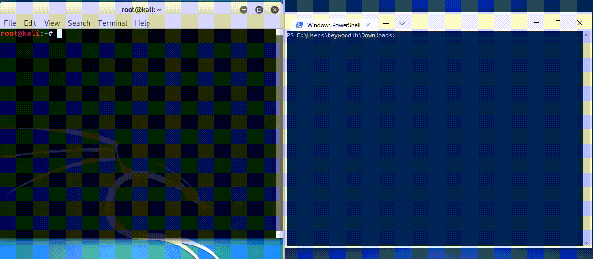

# ARPWATCH-GO
ARPWatch-Go is a tool for detecting changes in mac addresses. A common attack that takes place is known as an ARP cache poisoning attack. This attack tricks your machine into thinking that it is talking to the router, when it is really talking to a malicious third party.

## Requirements:

If on Linux, ensure that `arp` is installed and available within your $PATH. Not all Linux distributions come with `arp` preinstalled. Attempting to parse `/proc/net/arp` was a little too complicated (for my skillset), so it simplified things to have all platforms rely on the `arp` command.

The original `arpwatch` tool works perfectly fine on Linux at the moment so adding code for Linux specifically (like parsing `/proc/net/arp` instead of using `arp -a`) isn't a huge priority.

## How does it work?

Simply put, `arpwatch` parses the output of `arp -a`. It uses this to build an in memory model of the current ARP entries, and every few seconds it will check if any MAC addresses have changed within the ARP table. While this isn't a guarantee of malicious activity, it is a great potential indicator.

## Usage



### Installation

Download the binary for your system from the [releases page](https://github.com/heywoodlh/arpwatch-go/releases).

Place the binary in your `$PATH`. For example:

`/usr/local/bin/arpwatch`


### Executing the binary

To log ARP changes to STDOUT, run the `arpwatch` binary without any arguments.

For additional functionality, check the available arguments:

```
❯ arpwatch --help
Usage of arpwatch:
  -outfile string
        file to write logs to
  -quiet
        supress output
  -server string
        remote server to log to (UDP)
  -version
        print version
```

Example command with all flags

```
❯ arpwatch --outfile arp.log --quiet --server '192.168.1.50:514'
```
  

### Build from source

```
git clone https://github.com/heywoodlh/arpwatch-go
cd arpwatch-go
go build arpwatch.go
```


## Contributing

Dive right in! It's very primitive at the moment so any improvements or suggestions are more than welcome.
